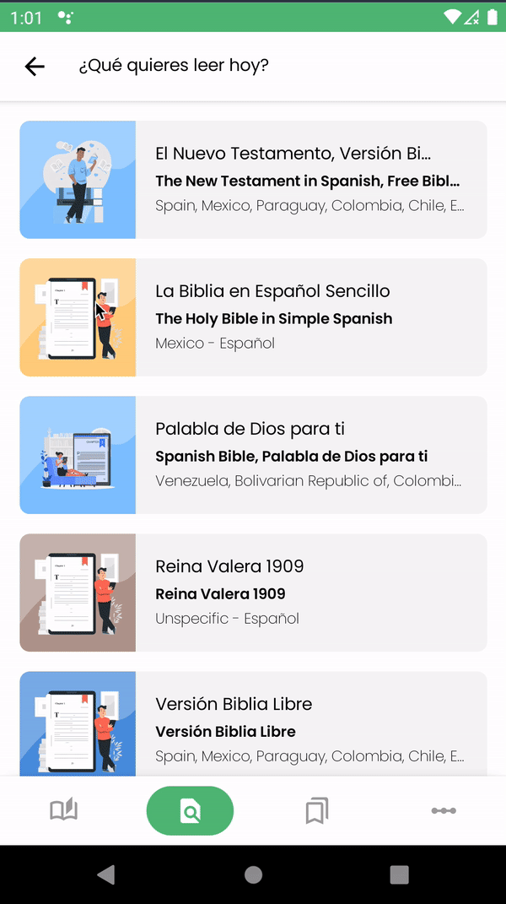
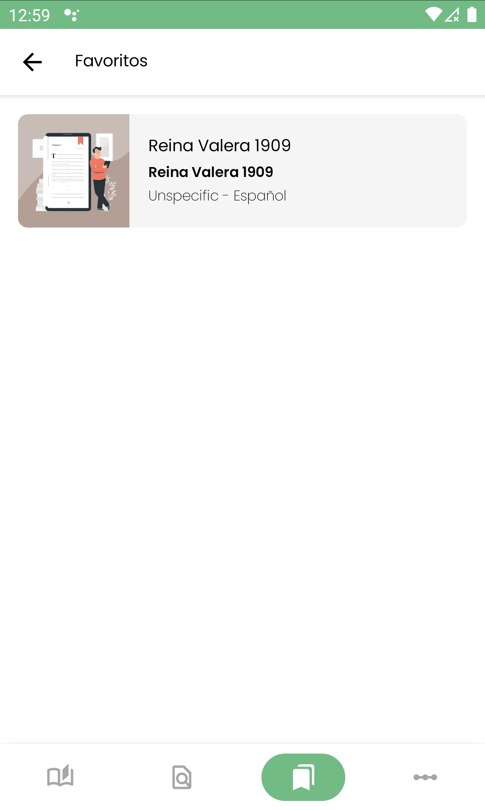
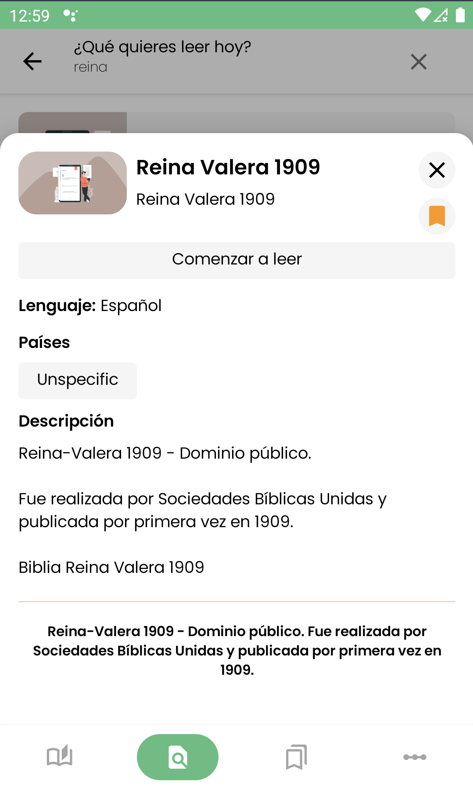

# Ready to read 

Ready to read is a small learning project focused on the different versions of the Bible that exist in different languages. Within which we will be able to find the following:

## Sections (random recommendations)

Here the books are loaded randomly where you can see the details of the book or start reading it.

## Search

We will be able to search from the name of the book, the country of origin or the written language.

## Favorites

Here we will see all the books we have added to Favorites.

## Book detail

This section appears when you LongClick on the book items and has action to add to Favorites and start reading from that same detail.

## Reading

It shows from the internal books of the bible, the ch apters and the verses (here we can make the text bigger or smaller).

## Want to contribute?

Here's what's left to do:

* Animate initial screen and data loading (maybe MotionLayout).
* Action for Next/Previous chapter (verses screen)
* Book Finder
* Action Verses: copy, generate image, add notes
* Error handling in content download
* Enable R8

# Useful Links

Resources downloaded using [Api.Bible](https://docs.api.bible/)

  

